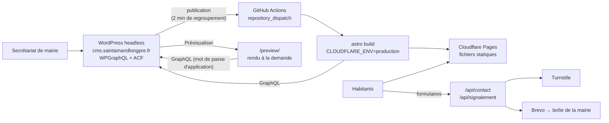

# Architecture

## Site public (`apps/web`)

- **Astro 7**, `output: 'static'` avec l'adaptateur `@astrojs/cloudflare` (v14), publié sur
  **Cloudflare Pages**. Presque toutes les pages sont pré-rendues ; seules `/preview/` et `/api/*`
  s'exécutent côté serveur (`export const prerender = false`). L'adaptateur ne produisant plus
  que le format Worker, le post-build (`integrations/post-build.ts`) le convertit en projet Pages
  « mode avancé » : code serveur dans `dist/client/_worker.js/` (jamais publié en statique) et
  `_routes.json` qui limite son exécution à ces deux routes.
  même pour une navigation (sinon Cloudflare servirait la page 404 statique).
- **Pré-rendu en Node** (`prerenderEnvironment: 'node'`) : Sharp optimise les images WordPress au
  build (AVIF/WebP, `srcset`).
- **Source de contenu** : `src/lib/content/` expose `getContent()` qui charge tout le contenu une
  fois par build, depuis le jeu de données (`fixtures.ts`) ou WordPress (`wordpress/`). Les deux
  sources produisent le même modèle (`types.ts`) ; les pages n'en connaissent qu'un.
- **Îlots React** uniquement pour les formulaires et la recherche. Le menu et le statut d'ouverture
  utilisent quelques lignes de JavaScript natif.
- **Recherche** : Pagefind indexe les pages au build (`integrations/post-build.ts`).
- **Redirections** : toutes les anciennes adresses du site sont redirigées (301) par le fichier
  `_redirects` généré au build depuis WordPress (réglage `sal_redirections`) : 1 002 règles
  exactes, leurs variantes, puis des règles de secours par rubrique. Vérification exhaustive :
  `pnpm check:redirects` (voir [reprise-contenu.md](reprise-contenu.md)).
- **Formulaires** : validation zod partagée navigateur/serveur, Turnstile, champ piège, limite
  envoi Brevo (Pages ne propose pas la liaison Rate Limiting ; `handler.ts` accepte un limiteur si
  besoin). Aucun message n'est stocké ; la photo d'un
  signalement est jointe à l'e-mail.
- **Prévisualisation** : WordPress signe le lien (HMAC-SHA256, 1 h de validité) ; la fonction Pages vérifie
  la signature puis lit le brouillon avec un mot de passe d'application.

## WordPress (`apps/cms`)

- Image officielle `wordpress:7.1.2-php8.3-apache`, MariaDB 11.8.
- Extensions : WPGraphQL, ACF (gratuit), WPGraphQL for ACF. Le modèle de contenu est défini en code
  dans `wordpress/mu-plugins/sal-content-model.php` (types, taxonomies, champs, réglages).
- `sal-headless.php` : front redirigé vers le site public, liens de prévisualisation signés,
  déclenchement du déploiement (GitHub `repository_dispatch`), allègement de l'administration.
- En production : seul Caddy est exposé (HTTPS Let's Encrypt automatique, `Caddyfile`) ; il sert
  aussi la redirection du domaine sans `www`. L'administration demande un mot de passe
  supplémentaire (authentification HTTP de Caddy) avant la connexion WordPress,
  sauvegardes quotidiennes chiffrées vers R2, cron WordPress piloté par un conteneur dédié.

| Type        | Contenu                                    | Champs ACF                                 |
| ----------- | ------------------------------------------ | ------------------------------------------ |
| Page        | Pages d'information, arborescence du site  | —                                          |
| Article     | Actualités (catégories)                    | —                                          |
| `evenement` | Agenda                                     | début, fin, journée entière, lieu, adresse |
| `seance`    | Séances du conseil municipal               | date, compte rendu (PDF)                   |
| `elu`       | Élus                                       | rôle, fonction, délégations                |
| `salle`     | Salles communales                          | capacité, places assises                   |
| `annuaire`  | Associations, commerces, numéros utiles…   | téléphone, e-mail, site, adresse           |
| `alerte`    | Bandeau d'information (canicule, travaux…) | niveau, lien, date d'expiration            |
| Réglages    | Coordonnées, horaires, photo d'accueil     | page Réglages → Mairie                     |

## Référencement et assistants IA

- **Données structurées** (schema.org, JSON-LD, `src/lib/seo.ts`) : chaque page porte un graphe
  commun reliant le site, la commune (`GovernmentOrganization`, codes Insee et SIREN), son territoire
  (`City`, lié à Wikidata et Wikipédia) et la mairie (`GovernmentOffice`, horaires). S'y ajoutent
  `WebPage` et `BreadcrumbList` sur chaque page, `NewsArticle`, `Event`, `EventVenue` (salles),
  la composition du conseil municipal et une `FAQPage`.
- **Page de référence** `/decouvrir/la-commune/` : faits sourcés (Insee, geo.api.gouv.fr,
  Service-Public) et questions fréquentes générées à partir des données du site
  (`src/lib/faq.ts`), donc toujours à jour.
- **`llms.txt` et `llms-full.txt`** ([convention llms.txt](https://llmstxt.org)) : résumé Markdown
  des faits essentiels et des rubriques, et texte intégral des pages principales.
- **`robots.txt`** : moteurs et assistants IA explicitement autorisés ; préférences d'usage
  (Content Signals) en commentaire.
- **`sitemap.xml`** généré depuis le contenu avec les dates de modification ; le build échoue si
  une page publiée n'y figure pas.
- **Fraîcheur** : date « Mis à jour le » visible et déclarée (`dateModified`) sur les pages.
- Balises Open Graph et Twitter, `max-image-preview:large`, adresses canoniques, 301 depuis
  l'ancien site. Lighthouse (build WordPress) : SEO 100, accessibilité 100, performance 94 à 100.
- Données officielles de la commune : `COMMUNE` dans `src/site.config.ts`.

## Choix notables

- **Pages plutôt que Workers** : le domaine reste chez Gandi (DNS non migré). Un projet Pages
  accepte un sous-domaine externe par simple CNAME, avec certificat automatique ; un Worker exige
  une zone DNS sur Cloudflare. Le domaine sans `www`, qu'un CNAME ne peut pas desservir, est
  redirigé par le serveur dédié.
- **Deux fichiers de configuration** dans `apps/web` : `wrangler.jsonc` décrit le projet Pages
  (appliqué à chaque déploiement) ; `wrangler.astro.jsonc`, au format Worker, sert à `astro dev`
  et `astro build`. Un test (`src/lib/wrangler-config.test.ts`) vérifie que leurs variables
  concordent.
- **Pas de lettre d'information** au lancement (décision de périmètre).
- **Pas de cookie** : Cloudflare Web Analytics et Turnstile n'en déposent pas ; aucun bandeau de
  consentement n'est nécessaire.
- **Blason** : fichier officiel de Wikimedia Commons (Spedona, CC BY-SA 3.0), utilisé sans
  modification comme logo et favicon ; crédit dans les mentions légales et
  `apps/web/public/images/CREDITS.md`. Toute version modifiée doit rester sous CC BY-SA.
- **Typographie** : Source Serif 4, Atkinson Hyperlegible Next (conçue pour la malvoyance) et Allura
  (devise), auto-hébergées via Fontsource.
