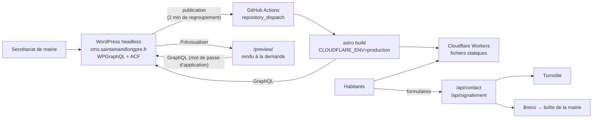

# Architecture

## Site public (`apps/web`)

- **Astro 7**, `output: 'static'` avec l'adaptateur `@astrojs/cloudflare` (v14, Workers). Presque
  toutes les pages sont pré-rendues ; seules `/preview/` et `/api/*` s'exécutent dans le Worker
  (`export const prerender = false`). `run_worker_first` garantit que ces routes atteignent le Worker
  même pour une navigation (sinon Cloudflare servirait la page 404 statique).
- **Pré-rendu en Node** (`prerenderEnvironment: 'node'`) : Sharp optimise les images WordPress au
  build (AVIF/WebP, `srcset`).
- **Source de contenu** : `src/lib/content/` expose `getContent()` qui charge tout le contenu une
  fois par build, depuis le jeu de données (`fixtures.ts`) ou WordPress (`wordpress/`). Les deux
  sources produisent le même modèle (`types.ts`) ; les pages n'en connaissent qu'un.
- **Îlots React** uniquement pour les formulaires et la recherche. Le menu et le statut d'ouverture
  utilisent quelques lignes de JavaScript natif.
- **Recherche** : Pagefind indexe les pages au build (`integrations/post-build.ts`).
- **Redirections** : les 500 anciennes adresses du site sont redirigées (301) par le fichier
  `_redirects` généré au build depuis WordPress (réglage `sal_redirections`).
- **Formulaires** : validation zod partagée navigateur/serveur, Turnstile, champ piège, limite
  d'envois (binding Rate Limiting), envoi Brevo. Aucun message n'est stocké ; la photo d'un
  signalement est jointe à l'e-mail.
- **Prévisualisation** : WordPress signe le lien (HMAC-SHA256, 1 h de validité) ; le Worker vérifie
  la signature puis lit le brouillon avec un mot de passe d'application.

## WordPress (`apps/cms`)

- Image officielle `wordpress:7.1.2-php8.3-apache`, MariaDB 11.8.
- Extensions : WPGraphQL, ACF (gratuit), WPGraphQL for ACF. Le modèle de contenu est défini en code
  dans `wordpress/mu-plugins/sal-content-model.php` (types, taxonomies, champs, réglages).
- `sal-headless.php` : front redirigé vers le site public, liens de prévisualisation signés,
  déclenchement du déploiement (GitHub `repository_dispatch`), allègement de l'administration.
- En production : aucun port ouvert (Cloudflare Tunnel), administration derrière Cloudflare Access,
  sauvegardes quotidiennes chiffrées vers R2, cron WordPress piloté par un conteneur dédié.

| Type        | Contenu                                    | Champs ACF                                 |
| ----------- | ------------------------------------------ | ------------------------------------------ |
| Page        | Pages d'information, arborescence du site  | —                                          |
| Article     | Actualités (catégories)                    | —                                          |
| `evenement` | Agenda                                     | début, fin, journée entière, lieu, adresse |
| `seance`    | Séances du conseil municipal               | date, compte rendu (PDF)                   |
| `elu`       | Élus                                       | rôle, fonction, délégations                |
| `salle`     | Salles communales                          | capacité, places assises                   |
| `annuaire`  | Associations, commerces, numéros utiles…   | téléphone, e-mail, site, adresse           |
| `alerte`    | Bandeau d'information (canicule, travaux…) | niveau, lien, date d'expiration            |
| Réglages    | Coordonnées, horaires, photo d'accueil     | page Réglages → Mairie                     |

## Choix notables

- **Workers plutôt que Pages** : l'adaptateur Cloudflare d'Astro 7 ne gère plus Pages. Les pages
  restent des fichiers statiques servis sans exécution de code.
- **Pas de lettre d'information** au lancement (décision de périmètre).
- **Pas de cookie** : Cloudflare Web Analytics et Turnstile n'en déposent pas ; aucun bandeau de
  consentement n'est nécessaire.
- **Blason** : fichier officiel de Wikimedia Commons (Spedona, CC BY-SA 3.0), utilisé sans
  modification comme logo et favicon ; crédit dans les mentions légales et
  `apps/web/public/images/CREDITS.md`. Toute version modifiée doit rester sous CC BY-SA.
- **Typographie** : Source Serif 4, Atkinson Hyperlegible Next (conçue pour la malvoyance) et Allura
  (devise), auto-hébergées via Fontsource.
